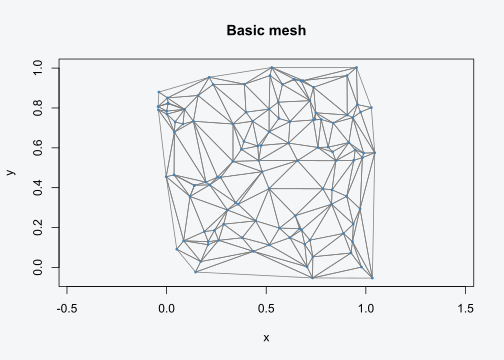
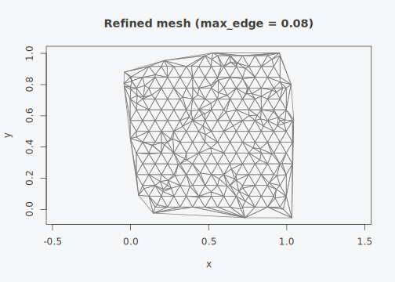
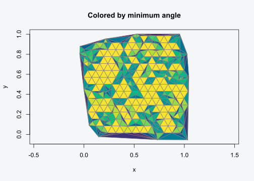

# Quick Start

## Your first mesh

tulpaMesh takes point coordinates and returns a triangulated mesh with
FEM matrices ready for SPDE models.

``` r

set.seed(42)
coords <- cbind(x = runif(100), y = runif(100))
mesh <- tulpa_mesh(coords)
mesh
#> tulpa_mesh:
#>   Vertices:   113 
#>   Triangles:  211 
#>   Edges:      323
```

The mesh extends slightly beyond the convex hull of your points
(controlled by `extend`). Plot it:

``` r

plot(mesh, vertex_col = "steelblue", main = "Basic mesh")
```



## Controlling mesh density

Use `max_edge` to add refinement points. The mesh generator places a
hexagonal lattice of points at this spacing, producing near-equilateral
triangles.

``` r

mesh_fine <- tulpa_mesh(coords, max_edge = 0.08)
mesh_fine
#> tulpa_mesh:
#>   Vertices:   337 
#>   Triangles:  579 
#>   Edges:      875
plot(mesh_fine, main = "Refined mesh (max_edge = 0.08)")
```



## Getting FEM matrices

[`fem_matrices()`](https://github.com/gcol33/tulpaMesh/reference/fem_matrices.md)
returns the three sparse matrices needed for SPDE models:

- **C**: mass matrix (consistent, symmetric positive definite)

- **G**: stiffness matrix (symmetric, zero row sums)

- **A**: projection matrix mapping mesh vertices to observation
  locations

``` r

fem <- fem_matrices(mesh_fine, obs_coords = coords)
dim(fem$C)
#> [1] 337 337
dim(fem$A)
#> [1] 100 337

# Verify key properties
all(Matrix::diag(fem$C) > 0)        # positive diagonal
#> [1] FALSE
max(abs(Matrix::rowSums(fem$G)))     # row sums ~ 0
#> [1] 2.842171e-14
range(Matrix::rowSums(fem$A))        # row sums = 1
#> [1] 1 1
```

For the SPDE Q-builder, you typically need the lumped (diagonal) mass
matrix:

``` r

fem_l <- fem_matrices(mesh_fine, obs_coords = coords, lumped = TRUE)
Matrix::isDiagonal(fem_l$C0)
#> [1] TRUE
```

## Using a formula interface

If your coordinates live in a data.frame, use a formula:

``` r

df <- data.frame(lon = runif(50), lat = runif(50), y = rnorm(50))
mesh_f <- tulpa_mesh(~ lon + lat, data = df)
mesh_f
#> tulpa_mesh:
#>   Vertices:   60 
#>   Triangles:  108 
#>   Edges:      167
```

## Mesh quality

Check triangle quality with
[`mesh_quality()`](https://github.com/gcol33/tulpaMesh/reference/mesh_quality.md)
and
[`mesh_summary()`](https://github.com/gcol33/tulpaMesh/reference/mesh_summary.md):

``` r

mesh_summary(mesh_fine)
#> Mesh quality summary (579 triangles):
#>   Min angle:     min=0.4  median=36.9  max=60.0 deg 
#>   Max angle:     min=60.0  median=81.7  max=179.2 deg 
#>   Aspect ratio:  min=1.00  median=1.22  max=9736.11   (1 = equilateral)
#>   Area:          min=2.36e-05  median=1.69e-03  max=1.51e-02 
#>   Warning: 118 triangles with min angle < 20 deg (20.4%)
```

Color triangles by minimum angle:

``` r

plot(mesh_fine, color = "quality", main = "Colored by minimum angle")
```



## Ruppert refinement

For guaranteed minimum angles, use `min_angle`:

``` r

mesh_r <- tulpa_mesh(coords, min_angle = 25, max_edge = 0.15)
mesh_summary(mesh_r)
#> Mesh quality summary (331 triangles):
#>   Min angle:     min=3.2  median=28.4  max=60.0 deg 
#>   Max angle:     min=60.0  median=90.8  max=168.5 deg 
#>   Aspect ratio:  min=1.00  median=1.48  max=51.82   (1 = equilateral)
#>   Area:          min=2.35e-05  median=2.60e-03  max=3.42e-02 
#>   Warning: 93 triangles with min angle < 20 deg (28.1%)
```

## Next steps

- [Spatial
  Workflows](https://github.com/gcol33/tulpaMesh/articles/workflows.md)
  – boundary constraints, barrier models, sf integration

- [Spherical and Temporal
  Meshes](https://github.com/gcol33/tulpaMesh/articles/advanced.md) –
  global meshes, space-time, metric graphs
