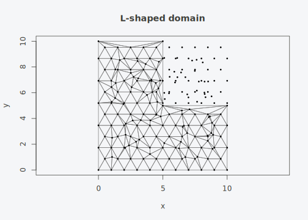
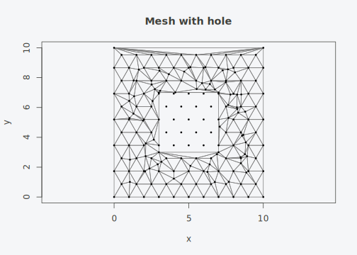

# Spatial Workflows

## Custom boundaries

By default,
[`tulpa_mesh()`](https://github.com/gcol33/tulpaMesh/reference/tulpa_mesh.md)
uses the convex hull extended by 10%. You can provide an explicit
boundary as a coordinate matrix:

``` r

set.seed(42)
coords <- cbind(runif(80, 1, 9), runif(80, 1, 9))

# L-shaped boundary
bnd <- rbind(
  c(0, 0), c(10, 0), c(10, 5),
  c(5, 5), c(5, 10), c(0, 10)
)

mesh <- tulpa_mesh(coords, boundary = bnd, max_edge = 1, extend = 0)
plot(mesh, vertex_col = "black", main = "L-shaped domain")
```



## sf polygon boundaries

Pass an sf polygon directly. CRS is preserved automatically.

``` r

library(sf)
#> Linking to GEOS 3.13.1, GDAL 3.11.4, PROJ 9.7.0; sf_use_s2() is TRUE

poly <- st_polygon(list(rbind(
  c(0, 0), c(10, 0), c(10, 10), c(0, 10), c(0, 0)
)))
sfc <- st_sfc(poly, crs = 32633)

mesh_sf <- tulpa_mesh(coords, boundary = sfc, max_edge = 1, extend = 0)
mesh_crs(mesh_sf)  # CRS attached
#> Coordinate Reference System:
#>   User input: EPSG:32633 
#>   wkt:
#> PROJCRS["WGS 84 / UTM zone 33N",
#>     BASEGEOGCRS["WGS 84",
#>         ENSEMBLE["World Geodetic System 1984 ensemble",
#>             MEMBER["World Geodetic System 1984 (Transit)"],
#>             MEMBER["World Geodetic System 1984 (G730)"],
#>             MEMBER["World Geodetic System 1984 (G873)"],
#>             MEMBER["World Geodetic System 1984 (G1150)"],
#>             MEMBER["World Geodetic System 1984 (G1674)"],
#>             MEMBER["World Geodetic System 1984 (G1762)"],
#>             MEMBER["World Geodetic System 1984 (G2139)"],
#>             MEMBER["World Geodetic System 1984 (G2296)"],
#>             ELLIPSOID["WGS 84",6378137,298.257223563,
#>                 LENGTHUNIT["metre",1]],
#>             ENSEMBLEACCURACY[2.0]],
#>         PRIMEM["Greenwich",0,
#>             ANGLEUNIT["degree",0.0174532925199433]],
#>         ID["EPSG",4326]],
#>     CONVERSION["UTM zone 33N",
#>         METHOD["Transverse Mercator",
#>             ID["EPSG",9807]],
#>         PARAMETER["Latitude of natural origin",0,
#>             ANGLEUNIT["degree",0.0174532925199433],
#>             ID["EPSG",8801]],
#>         PARAMETER["Longitude of natural origin",15,
#>             ANGLEUNIT["degree",0.0174532925199433],
#>             ID["EPSG",8802]],
#>         PARAMETER["Scale factor at natural origin",0.9996,
#>             SCALEUNIT["unity",1],
#>             ID["EPSG",8805]],
#>         PARAMETER["False easting",500000,
#>             LENGTHUNIT["metre",1],
#>             ID["EPSG",8806]],
#>         PARAMETER["False northing",0,
#>             LENGTHUNIT["metre",1],
#>             ID["EPSG",8807]]],
#>     CS[Cartesian,2],
#>         AXIS["(E)",east,
#>             ORDER[1],
#>             LENGTHUNIT["metre",1]],
#>         AXIS["(N)",north,
#>             ORDER[2],
#>             LENGTHUNIT["metre",1]],
#>     USAGE[
#>         SCOPE["Navigation and medium accuracy spatial referencing."],
#>         AREA["Between 12°E and 18°E, northern hemisphere between equator and 84°N, onshore and offshore. Austria. Bosnia and Herzegovina. Cameroon. Central African Republic. Chad. Congo. Croatia. Czechia. Democratic Republic of the Congo (Zaire). Gabon. Germany. Hungary. Italy. Libya. Malta. Niger. Nigeria. Norway. Poland. San Marino. Slovakia. Slovenia. Svalbard. Sweden. Vatican City State."],
#>         BBOX[0,12,84,18]],
#>     ID["EPSG",32633]]
```

### Polygons with holes

Holes in sf polygons become constraint edges that the mesh respects:

``` r

outer <- rbind(c(0, 0), c(10, 0), c(10, 10), c(0, 10), c(0, 0))
hole  <- rbind(c(3, 3), c(7, 3), c(7, 7), c(3, 7), c(3, 3))
poly_h <- st_polygon(list(outer, hole))

# Remove points inside the hole
inside <- coords[, 1] > 3 & coords[, 1] < 7 & coords[, 2] > 3 & coords[, 2] < 7
pts_outside <- coords[!inside, ]

mesh_h <- tulpa_mesh(pts_outside, boundary = st_sfc(poly_h), max_edge = 1, extend = 0)
plot(mesh_h, vertex_col = "black", main = "Mesh with hole")
```



## Barrier models

Physical barriers (coastlines, rivers) prevent the spatial field from
smoothing across them. Mark barrier triangles and pass them to
[`fem_matrices()`](https://github.com/gcol33/tulpaMesh/reference/fem_matrices.md):

``` r

set.seed(42)
coords <- cbind(runif(100, 0, 10), runif(100, 0, 10))
mesh <- tulpa_mesh(coords, max_edge = 0.8)

# A river running through the domain
river <- rbind(c(4, 0), c(6, 5), c(4, 10))
bt <- barrier_triangles(mesh, river)

cat(sum(bt), "barrier triangles out of", mesh$n_triangles, "\n")
#> 56 barrier triangles out of 579

# FEM with barrier: stiffness is zeroed for barrier triangles
fem_b <- fem_matrices(mesh, barrier = bt)

# Compare: barrier mesh has fewer stiffness nonzeros
fem_n <- fem_matrices(mesh)
cat("Nonzeros without barrier:", length(fem_n$G@x), "\n")
#> Nonzeros without barrier: 2047
cat("Nonzeros with barrier:   ", length(fem_b$G@x), "\n")
#> Nonzeros with barrier:    1905
```

## Mesh subdivision

Split every triangle into 4 for uniform refinement:

``` r

set.seed(42)
mesh <- tulpa_mesh(cbind(runif(20), runif(20)))
sub <- subdivide_mesh(mesh)
cat("Original:", mesh$n_triangles, "triangles\n")
#> Original: 46 triangles
cat("Subdivided:", sub$n_triangles, "triangles\n")
#> Subdivided: 184 triangles
```

## Adaptive refinement

Refine only where error indicators are high. This is the typical
workflow after an initial SPDE solve: the solver returns posterior
variance per triangle, and you refine where variance is large.

``` r

set.seed(42)
mesh <- tulpa_mesh(cbind(runif(50), runif(50)), max_edge = 0.15)

# Simulate error indicators (high in one corner)
q <- mesh_quality(mesh)
centroids <- cbind(
  (mesh$vertices[mesh$triangles[,1], 1] + mesh$vertices[mesh$triangles[,2], 1] +
   mesh$vertices[mesh$triangles[,3], 1]) / 3,
  (mesh$vertices[mesh$triangles[,1], 2] + mesh$vertices[mesh$triangles[,2], 2] +
   mesh$vertices[mesh$triangles[,3], 2]) / 3
)
error <- exp(-3 * centroids[, 1])  # high error near x = 0

refined <- refine_mesh(mesh, error, fraction = 0.3)
cat("Before:", mesh$n_triangles, "triangles\n")
#> Before: 211 triangles
cat("After: ", refined$n_triangles, "triangles\n")
#> After:  370 triangles
```

## Mesh operations

### Extract submesh

``` r

set.seed(42)
mesh <- tulpa_mesh(cbind(runif(50, 0, 10), runif(50, 0, 10)), max_edge = 1)

# Keep only left half
q <- mesh_quality(mesh)
centroids_x <- (mesh$vertices[mesh$triangles[,1], 1] +
                mesh$vertices[mesh$triangles[,2], 1] +
                mesh$vertices[mesh$triangles[,3], 1]) / 3
left <- subset_mesh(mesh, centroids_x < 5)
left
#> tulpa_mesh:
#>   Vertices:   86 
#>   Triangles:  144 
#>   Edges:      229
```

### Find disconnected components

``` r

comps <- mesh_components(mesh)
cat("Number of components:", max(comps), "\n")
#> Number of components: 1
```

## Converting from fmesher

If you have an existing fmesher mesh, convert it directly:

``` r

library(fmesher)
#> Warning: package 'fmesher' was built under R version 4.5.3
fm <- fm_mesh_2d(loc = coords, max.edge = c(1, 3))
tm <- as_tulpa_mesh(fm)
tm
#> tulpa_mesh:
#>   Vertices:   507 
#>   Triangles:  965 
#>   Edges:      1471
```

FEM matrices from the converted mesh match fmesher’s output exactly.
